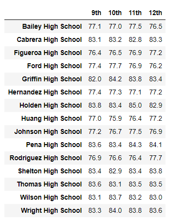
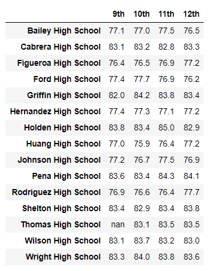
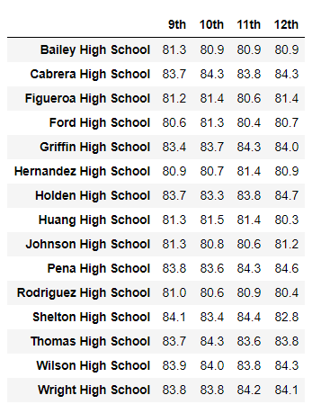
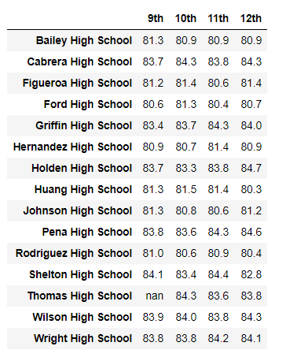
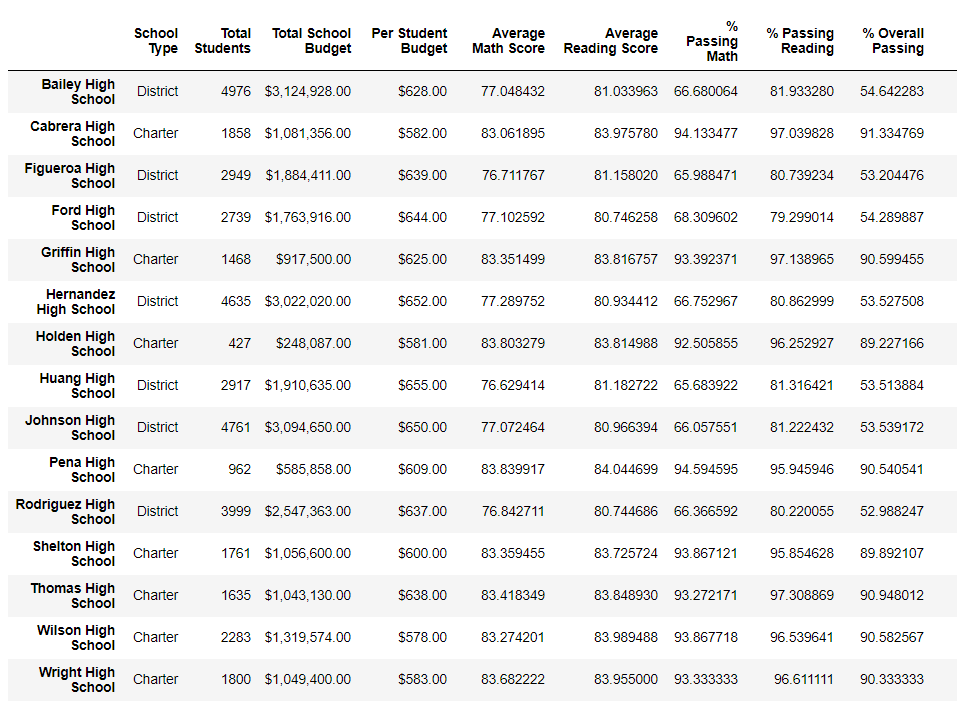
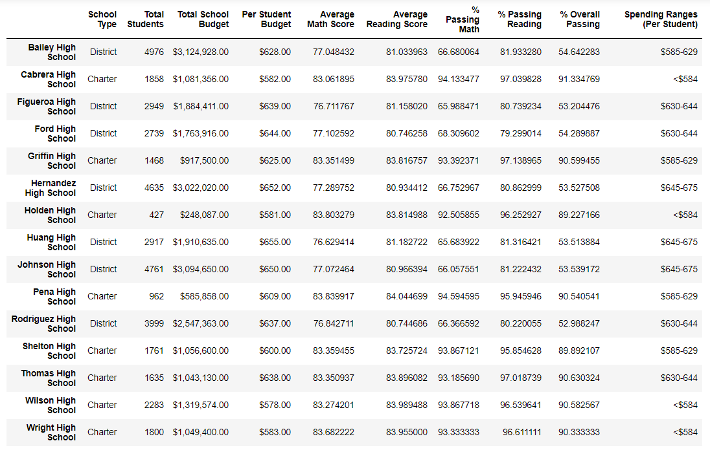

# School_District_Analysis

## Overview of Project

### The purpose of this project is to analyze the grades for all of the high schools in a city district.  After the initial analysis, we were notified that the grades for Thomas High School 9th grade were not reliable.  These grades were dropped, and the analysis was reperformed. Below are the results from the inital and reperformed anlyses.

## Results

### Math scores:

### Math scores excluding Thomas High School 9th grade

### Reading scores

### Reading scores excluding Thomas High School 9th grade

### Overall School Summary

### Overall School Summary excluding Thomas High School 9th grade

## Summary

